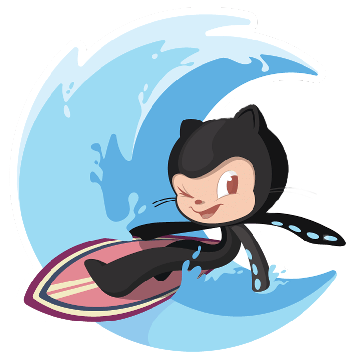

  

<h2 align="center">
  DMM Studio
</h2>

Repo organising all my personal projects.

 

### Websites
- [Apple](https://github.com/diegommagno/dmm-studio/tree/main/websites/apple/01)
- [Sushi](https://github.com/diegommagno/dmm-studio/tree/main/websites/sushi)

 

### Components
#### Dropdowns
- [dropdown-1](https://github.com/diegommagno/dmm-studio/tree/main/components/dropdowns/dropdown-1)

#### Navigation bars
##### JavaScript
- [navbar-1](https://github.com/diegommagno/dmm-studio/tree/main/components/navigation-bars/javascript/navbar-1)
- [navbar-2](https://github.com/diegommagno/dmm-studio/tree/main/components/navigation-bars/javascript/navbar-2)

 

### Origamid
##### Projects
- [Calculator](https://github.com/diegommagno/dmm-studio/tree/main/origamid/events/calculator)

 

