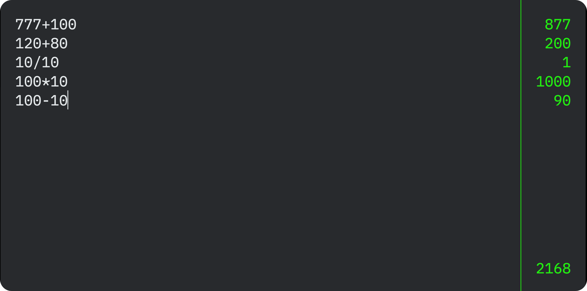

# Calculator

> Calculator made with HTML, CSS and TypeScript.
 

  

 

## 📝 Live Preview 

- [Calculator](https://diegommagno.com/github/ocean-labs/main/origamid/events/calculator)

## 🧑🏻‍💻 Technologies

- HTML
- CSS
- TypeScript

## 🎓 Worked on

- GitHub Copilot
- Creating a RegEx for a-zA-Z#$<>{}!
- Creating a split(RegEx)
- addEventListener on input