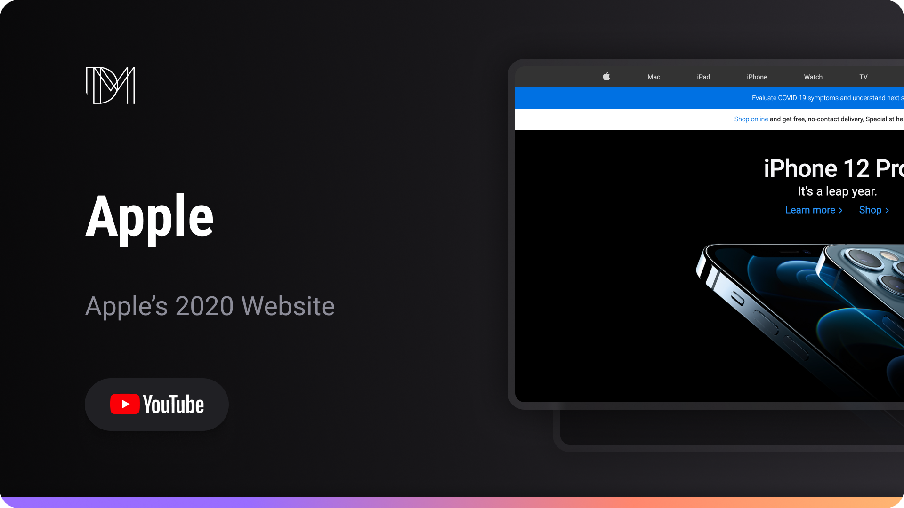

<h1 align="center"> Apple </h1>

Reconstructing Apple's previous website versions.  

  <a href="#-live-preview">Live Preview</a>&nbsp;&nbsp;&nbsp;|&nbsp;&nbsp;&nbsp;
  <a href="#-layout">Layout</a>&nbsp;&nbsp;&nbsp;|&nbsp;&nbsp;&nbsp;
  <a href="#-technologies">Technologies</a>&nbsp;&nbsp;&nbsp;|&nbsp;&nbsp;&nbsp;

 

  

 

## 📝 Live Preview 

- [Apple](https://dmm.studio/github/dmm-studio/main/websites/apple/01/)

 

  

 

## 🎨 Layout

- You can check the layout video [here](https://www.youtube.com/watch?v=A3CwMiVyeW4&ab_channel=OCode). 

## 🧑🏻‍💻 Technologies

- HTML
- SCSS
