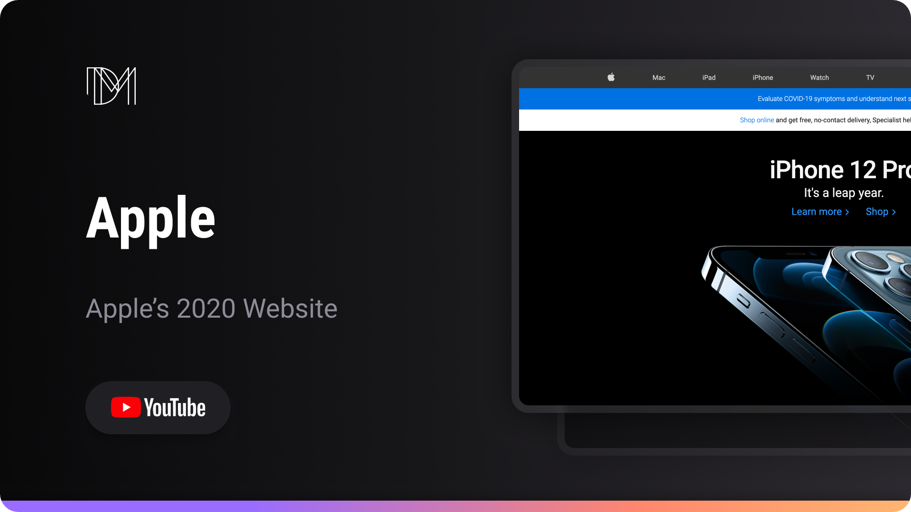

<h1 align="center"> Apple </h1>

Reconstructing Apple's previous website versions.  

  <a href="#-live-preview">Live Preview</a>&nbsp;&nbsp;&nbsp;|&nbsp;&nbsp;&nbsp;
  <a href="#-layout">Layout</a>&nbsp;&nbsp;&nbsp;|&nbsp;&nbsp;&nbsp;
  <a href="#-technologies">Technologies</a>&nbsp;&nbsp;&nbsp;|&nbsp;&nbsp;&nbsp;
  <a href="#-worked-on">Worked On</a>

 

  

 

## 📝 Live Preview 

- [Apple](https://dmm.studio/github/dmm-studio/main/websites/apple/01/)

 

  

 

## 🎨 Layout

- You can check the layout [here](https://www.figma.com/community/file/1240650697984569274). You will need a [Figma](https://figma.com) account to access it.

## 🧑🏻‍💻 Technologies

- HTML
- SCSS

## 🎓 Worked on

- CSS: `flex`, `rem`
