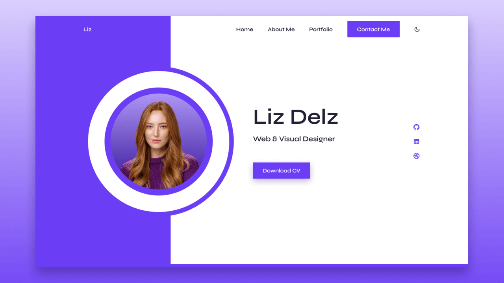

<h1 align="center"> Responsive Portfolio Website Liz </h1>

  The project is to develop a responsive portfolio website.

  <a href="#-live-preview">Live Preview</a>&nbsp;&nbsp;&nbsp;|&nbsp;&nbsp;&nbsp;
  <a href="#-layout">Layout</a>&nbsp;&nbsp;&nbsp;|&nbsp;&nbsp;&nbsp;
  <a href="#-technologies">Technologies</a>&nbsp;&nbsp;&nbsp;|&nbsp;&nbsp;&nbsp;
  <a href="#-worked-on">Worked On</a>

 

  

 

## 📝 Live Preview 

- [Portfolio Website](https://dmm.studio/dmm-studio/websites/portfolio/01)

 

  

 

## 🎨 Layout

- You can check the layout [here](https://youtu.be/F2_6rFk-UC8) on YouTube.

## 🧑🏻‍💻 Technologies

- HTML
- CSS
- JavaScript

## 🎓 Worked on

- CSS: `flex`, `rem`, `:is()`

- Responsive Personal Portfolio Website Using HTML CSS & JavaScript
- Contains several pages (About, Work & Contact)
- Includes a dark & light theme.
- Sending emails in the contact section.
- Developed first with the Mobile First methodology, then for desktop.
- Compatible with all mobile devices and with a beautiful and pleasant user interface.
